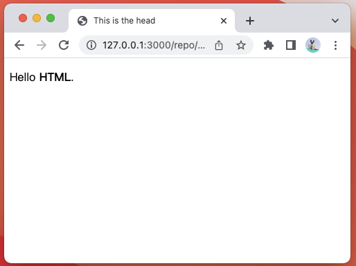

# WTF HTML极简教程: 1. Hello HTML （9行代码）

WTF HTML教程，帮助新人快速入门HTML。

**推特**：[@WTFAcademy_](https://twitter.com/WTFAcademy_)  ｜ [@0xAA_Science](https://twitter.com/0xAA_Science) 

**WTF Academy社群：** [官网 wtf.academy](https://wtf.academy) | [WTF Solidity教程](https://github.com/AmazingAng/WTFSolidity) | [discord](https://discord.wtf.academy) | [微信群申请](https://docs.google.com/forms/d/e/1FAIpQLSe4KGT8Sh6sJ7hedQRuIYirOoZK_85miz3dw7vA1-YjodgJ-A/viewform?usp=sf_link)

所有代码和教程开源在github: [github.com/WTFAcademy/WTF-HTML](https://github.com/WTFAcademy/WTF-HTML)

---

这一讲，我们介绍HTML基础，并写第一个HTML程序：Hello HTML（9行代码）。你也可以直接阅读[MDN HTML基础](https://developer.mozilla.org/zh-CN/docs/Learn/Getting_started_with_the_web/HTML_basics)。


## 什么是 HTML ？

网络，或更具体的说，万维网（World Wide Web）是由很多链接在一起的文档和资源构成的。这些文档和资源是用HTML（**H**yper**t**ext **M**arkup **L**anguage，超文本标记语言）编写的，它们被称为网页。HTML是网页的基础，定义了网页的结构和内容。

当你在浏览器中输入一个网址（例如，www.example.com）时，浏览器会发送一个请求到提供该网页的服务器。服务器会响应这个请求，并将请求的网页（也就是一些HTML）发送回浏览器。然后，浏览器会解析这些HTML，并将它们显示为你通常看到的网页。

HTML 不是一门编程语言，而是一种用于定义内容结构的*标记语言*。HTML 由一系列的**元素**（`element`）组成，这些元素可以用来包围不同部分的内容，使其以某种方式呈现或者工作。一对标签（`tag`）可以为一段文字或者一张图片添加超链接，将文字设置为斜体，改变字号，等等。例如下面内容：

```plain
My cat is very grumpy
```

可以将这行文字封装成一个段落（**p**aragraph）元素来使其在单独一行呈现：

```html
<p>My cat is very grumpy</p>
```

## HTML、CSS和JavaScript的区别

- **HTML**：HTML是用来定义网页的结构和内容的。它由一系列的元素组成，元素可以包含文本、链接、图片等。

- **CSS**：CSS（Cascading Style Sheets，级联样式表）是一种样式表语言，用于描述HTML元素的样式，包括颜色、布局和字体等。CSS可以使你的网页看起来更漂亮，也可以实现响应式设计，使你的网页在不同的设备上看起来都很好。

- **JavaScript**：JavaScript是一种编程语言，可以使网页具有交互性。例如，JavaScript可以使网页对用户的行为做出反应，如点击按钮、提交表单等。

## HTML 元素

HTML文档由HTML元素组成。HTML元素由标签、内容和结束标签组成。例如，一个段落元素如下所示：

```html
<p>This is a paragraph.</p>
```

浏览器中效果：

<p>This is a paragraph.</p>


在这个例子中，`<p>`是开始标签，`This is a paragraph.`是内容，`</p>`是结束标签。

HTML元素可以有属性，属性提供了元素的额外信息，例如，一个链接元素如下所示：

```html
<a href="https://www.example.com">This is a link</a>
```

浏览器中效果：

<a href="https://www.example.com">This is a link</a>

在这个例子中，`href`是一个属性，它指定了链接的目标地址。

## 开发工具

我们建议大家使用 [VSCode](https://code.visualstudio.com/download) 开发 HTML，并用浏览器（Chrome）打开`.html`文件进行浏览。

## Hello HTML

现在我们要写第一个 HTML 程序：Hello HTML（9行代码），看看单个元素如何彼此协同构成一个完整的 HTML 页面。

```html
<!DOCTYPE html>
<html>
  <head>
    <title>This is the head</title>
  </head>
  <body>
    <p>Hello <strong>HTML</strong>.</p>
  </body>
</html>
```



Hello HTML中包括以下元素：

- `<!DOCTYPE html>` — 文档类型，保证文档正常读取。。
- `<html></html>` — `html` 元素，包含整个页面的内容，也称作根元素。
- `<head></head>` — `head` 元素，它的内容对用户不可见，其中包含例如面向搜索引擎的搜索关键字（keyword）、页面描述、CSS 样式表和字符编码声明等。
- `<title></title>` — `title` 元素。该元素设置页面的标题，显示在浏览器标签页上，也作为收藏网页的描述文字。
- `<body></body>` — `body` 元素。该元素包含期望让用户在访问页面时看到的内容，包括文本、图像、视频、游戏、可播放的音轨或其他内容。
- `<p></p>` - 段落元素，表示文本的一个段落，通常表现为一整块与相邻文本分离的文本，或以垂直的空白隔离或以首行缩进。

## 总结

这一讲我们介绍了什么是HTML，HTML的元素和开发工具，并且写了第一个HTML程序：Hello HTML。