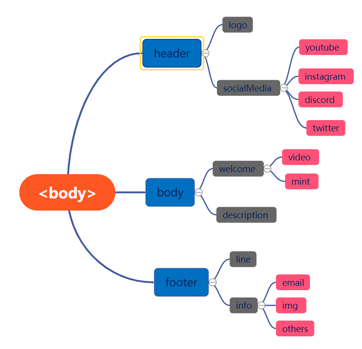

# WTF HTML极简教程: 10. BAYC官网

WTF HTML教程，总结/搬运自[MDN HTML教程](https://developer.mozilla.org/zh-CN/docs/Learn/HTML)，帮助新人快速入门HTML。

**推特**：[@WTFAcademy_](https://twitter.com/WTFAcademy_)  ｜ [@0xAA_Science](https://twitter.com/0xAA_Science) 

**WTF Academy社群：** [官网 wtf.academy](https://wtf.academy) | [WTF Solidity教程](https://github.com/AmazingAng/WTFSolidity) | [discord](https://discord.wtf.academy) | [微信群申请](https://docs.google.com/forms/d/e/1FAIpQLSe4KGT8Sh6sJ7hedQRuIYirOoZK_85miz3dw7vA1-YjodgJ-A/viewform?usp=sf_link)

所有代码和教程开源在github: [github.com/WTFAcademy/WTF-HTML](https://github.com/WTFAcademy/WTF-HTML)

---

这一讲，我们将编写一个 [BAYC官网](https://boredapeyachtclub.com/) 的极简HTML页面

>BAYC官网也是用React编写的，在此我们降低难度用HTML编写。

## 分析页面结构

HTML文件决定了页面的结构，因此当我们拿到一个页面后，在编写前首先要分析它的结构。


我们可以将Uniswap的页面拆分成如下结构（相同颜色的框为同一级）：


然后我们就可以画出该页面的结构树：



得到结构树后页面的结构就十分清晰了，下面我们就开始编写代码。

## 编写代码

### `<head>`

在 `<head>` 中我们可以设置页面的 `title` 和图标。

```html
    <link rel="icon" href="./img/icon.png">
    <title>BAYC</title>
```
### 头部结构


首先我们处理头部结构，这部分包括一个bayc-logo和社交媒体，社交媒体全部包含在一个类名为`socialMedia`的`div`中，每个社交媒体的结构都为一个`a`嵌套一个`img`

```html
    <div class="header">
        
        <div class="socialMedia">
            <a href="https://www.youtube.com/channel/UCB6R9NAjkgxQi_QEkc4O25Q">
                
            </a>
            <a href="https://boredapeyachtclub.com/#/">
                
            </a>
            <a href="https://discord.com/invite/3P5K3dzgdB">
                
            </a>
            <a href="https://twitter.com/BoredApeYC">
                
            </a>
        </div>
    </div>
```

### 中间结构


然后是中间部分，中间部分包含了一个欢迎界面和一段自我描述。自我描述非常简单，用`div`或者`p`都可以；欢迎界面的背景是一个`video`，然后左下角是`mint`界面，包含了一条欢迎语和一个`button`，欢迎语用`div`、`p`、`h1`都可以

```html
    <div class="body">
        <div class="welcome">
            <video autoplay loop>
                <source src="https://ik.imagekit.io/bayc/assets/club-landing.mp4" type="video/mp4">
            </video>
            <div class="mint">
                <h1>
                    WELCOME TO <br />THE BORED APE<br /> YACHT CLUB
                </h1>
                <button>Mint</button>
            </div>
        </div>
        <div class="description">A limited NFT collection where the token itself doubles as your membership to a
            swamp club for apes. The club is open! Ape in with us.
        </div>
    </div>
```

### 尾部结构


尾部所占的空间比较少，但内容比较多，结构也比较复杂

首先可以粗略地分为上面一条分割线和剩余的类名为`info`的`div`

分割线的代码写`<div class="line"></div>`即可，标签里面的内容留空，后面可以通过CSS把这条线画出来

`info`中可以分为三部分——左边的邮箱、中间的`img`和右边的其他信息

邮箱部分分为上面的一个提示语`GET ON THE LIST`和下面的填写框，填写框里包含一个`input`和值为`➡`的`button`

最后就是右边的其他信息，每一行用`div`编写即可。第一行也是社交媒体，结构与上面类似因此这里就不再赘述

```html
    <div class="footer">
        <div class="line"></div>
        <div class="info">
            <div class="email">
                <div class="get-on-the-list">GET ON THE LIST</div>
                <div class="getEmail">
                    <input type="email" placeholder="Email Address" required value>
                    <button type="submit">➡</button>
                </div>
            </div>
            
            <div class="others">
                <div>
                    <div class="socialMedia">
                        <a href="https://www.youtube.com/channel/UCB6R9NAjkgxQi_QEkc4O25Q">
                            
                        </a>
                        <a href="https://boredapeyachtclub.com/#/">
                            
                        </a>
                        <a href="https://discord.com/invite/3P5K3dzgdB">
                            
                        </a>
                        <a href="https://twitter.com/BoredApeYC">
                            
                        </a>
                    </div>
                </div>
                <div>
                    <div class="copyright">
                        © 2021 Yuga Labs LLC
                    </div>
                </div>
                <div>
                    <a href="https://boredapeyachtclub.com/#/terms">BAYC Terms & Conditions</a>
                </div>
                <div>
                    <a href="https://boredapeyachtclub.com/#/mayc/terms">MAYC Terms & Conditions</a>
                </div>
            </div>
        </div>
    </div>
```

到此BAYC的极简HTML页面代码就写完了，我们可以在页面中打开查看效果。


可以看到，我们的页面是非常丑陋的，同时基本上没有任何功能，这需要我们后期再给它加上 CSS 和 JavaScript。

## 习题

修改 HTML 代码，将极简 BAYC 页面改为 [doodles](https://doodles.app/) 页面。


## 总结

这一讲我们用所学的 HTML 知识编写出了一个 BYAC 的极简 HTML 页面。我们将在之后的 `WTF-CSS` 和 `WTF-JavaScript` 中继续完善它。